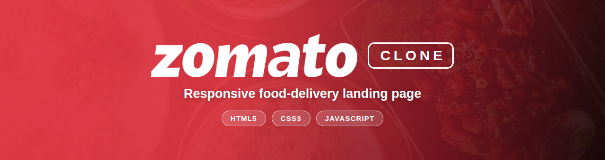
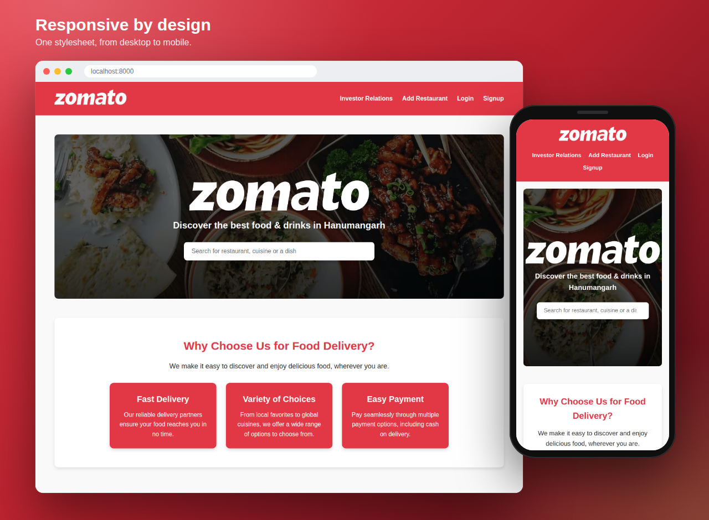

<h1 align="center">
  
</h1>

<p align="center">
  <b>A responsive food-delivery landing page built with pure HTML, CSS &amp; JavaScript.</b><br>
  No frameworks. No build step. Just open <code>index.html</code>.
</p>

<p align="center">
  
  
  
  <a href="LICENSE"></a>
</p>

<p align="center">
  <a href="#-preview">Preview</a> &nbsp;•&nbsp;
  <a href="#-features">Features</a> &nbsp;•&nbsp;
  <a href="#-quick-start">Quick Start</a> &nbsp;•&nbsp;
  <a href="#-project-structure">Structure</a> &nbsp;•&nbsp;
  <a href="#-roadmap">Roadmap</a>
</p>

---

## 📸 Preview

<p align="center">
  
</p>

## 📖 About

Zomato Clone recreates the look and feel of the Zomato home page: a red-branded header, a hero section with a search bar, and a "Why Choose Us" section with feature cards. Because it is written in vanilla HTML, CSS and JavaScript, it works as a compact reference for semantic markup, Flexbox layouts, responsive design and small DOM interactions.

## ✨ Features

| 🎨 Branded header | 🍜 Hero & search | ⚡ Animated search |
| :--- | :--- | :--- |
| Zomato-red (`#e23744`) bar with the logo and links to Investor Relations, Add Restaurant, Login and Signup — each turns gold on hover. | Full-width food photo with a dark overlay for readable text, a location tagline and a prominent search bar. | JavaScript smoothly resizes the search field when it gains or loses focus. |

| 🃏 Feature cards | 📱 Responsive layout | 🧩 Semantic & accessible |
| :--- | :--- | :--- |
| "Why Choose Us" cards — Fast Delivery, Variety of Choices and Easy Payment — that lift on hover. | Flexbox plus a 768 px breakpoint: the header stacks and the cards resize on tablets and phones. | Landmark elements (`header`, `nav`, `main`, `section`, `footer`), image `alt` text and an `aria-label` on the search field. |

## 🧰 Tech Stack

| | Technology | What it does here |
| :-: | :-- | :-- |
| 🧱 | **HTML5** | Semantic structure and accessibility attributes |
| 🎨 | **CSS3** | Flexbox layout, media queries, transitions and the `::before` image overlay |
| ⚡ | **JavaScript (ES6)** | DOM events for the search-bar animation |

Runs in any modern browser — no Node.js, bundler or package manager required.

## 🚀 Quick Start

```bash
# 1. Clone the repository
git clone https://github.com/vinayakmishra4/ZOMATO-CLONE.git

# 2. Enter the project folder
cd ZOMATO-CLONE

# 3. Start a local server  (use `python` instead of `python3` on Windows)
python3 -m http.server 8000
```

Then open **<http://localhost:8000>** in your browser.

<details>
<summary><b>Other ways to run it</b></summary>

<br>

- **Open the file directly:** `open index.html` (macOS) · `start index.html` (Windows) · `xdg-open index.html` (Linux)
- **VS Code:** install the *Live Server* extension, then click **Go Live**.

</details>

### 🎯 Things to try

| Do this | …and watch it |
| :-- | :-- |
| Hover over a navigation link | The link turns gold |
| Click into the search bar | The field animates its width |
| Hover over a feature card | The card lifts and its shadow deepens |
| Resize the window below 768 px | The header stacks and the layout adapts |

> [!NOTE]
> The navigation links (Investor Relations, Add Restaurant, Login, Signup) point to pages that are not built yet — they're first on the [roadmap](#-roadmap).

<details>
<summary><b>Customise it</b></summary>

<br>

The tagline and city live in the hero section of `index.html`:

```html
<p>Discover the best food &amp; drinks in Hanumangarh</p>
```

The primary brand colour (`#e23744`) and all layout rules are in `css/style.css`.

</details>

## 📁 Project Structure

```text
ZOMATO-CLONE/
├── css/
│   └── style.css          # Theme, layout, hover effects, responsive rules
├── docs/
│   ├── banner.png         # README header banner
│   └── preview.png        # Desktop + mobile preview used in this README
├── image/
│   ├── bg.png             # Hero section background
│   ├── logo.png           # Logo used in the header and hero
│   └── Zomato_logo.png    # Additional logo asset
├── js/
│   └── script.js          # Search bar focus/blur animation
├── index.html             # Home page
├── LICENSE                # MIT License
└── README.md              # You are here
```

## 🧭 Roadmap

- [x] Branded header with navigation
- [x] Hero section with search bar and focus animation
- [x] "Why Choose Us" feature cards
- [x] Responsive layout (768 px breakpoint)
- [ ] Login and Signup pages
- [ ] Add Restaurant and Investor Relations pages
- [ ] Working search — load restaurants and dishes from JSON and filter as you type
- [ ] Restaurant listings, menu pages and a cart / checkout flow

## 📌 Disclaimer

This is a non-commercial learning project. Zomato's name and logo are trademarks of their respective owners, and this project is not affiliated with or endorsed by Zomato.

## 👤 Author

**Vinayak Mishra**

<a href="https://github.com/vinayakmishra4"></a>

## 📄 License

Distributed under the **MIT License**. See [`LICENSE`](LICENSE) for details.

---

<p align="center">
  <b>If you like this project, please consider giving it a ⭐</b>
</p>